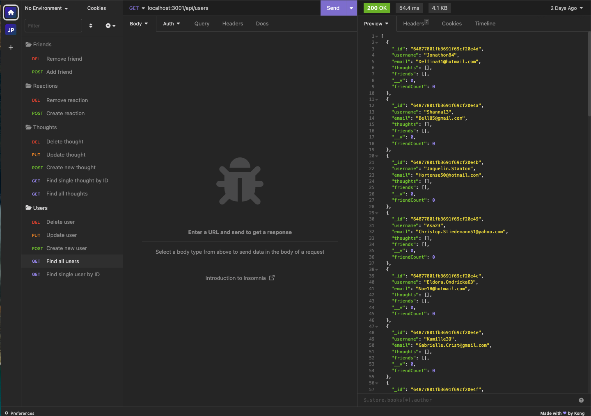

# 18-Social-Network-API

  
  
    

  ## Table of Contents

  * [Description](#description)
  * [Installation](#installation)
  * [Usage](#usage)
  * [MIT](https://choosealicense.com/licenses/MIT)
  * [Contributing](#contributing)
  * [Tests](#tests)
  * [Questions](#questions)
  
  ## [Description](#table-of-contents)

  This project is an API for a social network web application where users can share their thoughts, react to friends' thoughts, and create and remove friends. This back-end application uses Express.js for routing, a MongoDB database, and the Mongoose ODM. Moment.js is utilized to format timestamps and the Faker-js npm package is used to seed the database for route testing in Insomnia.

  ## [Installation](#table-of-contents)

  Ensure Node.js is installed on your local machine. Next, clone the repository for this project . Use the command `npm i` to install all required dependencies. Then, seed the database via Faker-js using the command `node utils/seed.js`.

  ## [Usage](#table-of-contents)

  Start the server in the command line with `node index.js`. Then access the API routes in Insomnia or a like-testing client. Watch the below demonstration video to see the GET, POST, PUT, and DELETE routes being tested.   

  [Video Demonstration](https://drive.google.com/file/d/1bcY2ktWU5ytpbXKCrakvsVI_I4kYDJTe/view)

  

  **GET AND DELETE ROUTES**                                                                                                     
| User            | URL                                  | Thought            | URL                                         |
|-----------------|--------------------------------------|--------------------|---------------------------------------------|
| Get All Users   | /api/users                           | Get All Thoughts   | /api/thoughts                               |
| Get Single User | /api/users/:userId                   | Get Single Thought | /api/users/:thoughtId                       |
| Delete User     | /api/users/:userId                   | Delete Thought     | /api/users/:thoughtId                       |
| Delete Friend   | /api/users/:userId/friends/:friendId | Delete Reaction    | /api/users/:thoughtId/reactions/:reactionId |

**POST AND PUSH ROUTES**        
|                      | URL                                                       | JSON                                                                            |
|----------------------|-----------------------------------------------------------|---------------------------------------------------------------------------------|
| Create User          | /api/users                           | ```{ "username": "example", "email": "example@email.com" }```                   |
| Update User          | /api/users/:userId                   | ```{ "username": "example", "email": "example@email.com" }```                   |
| Add Friend           | /api/users/:userId/friends/:friendId |                                                                                 |
| Create Thought       | /api/thoughts                        | ```{ "thoughtText": "Lorem Ipsum", "username": "example", "userId": "123" }```  |
| Update Thought       | /api/thoughts/:thoughtId             | ```{ "thoughtText": "Lorem Ipsum" }```                                          |
| Create Reaction      | /api/thoughts/:thoughtId/reactions   | ```{ "reactionBody": "Lorem!", "username": "example" }```                      |

  ## [License](#table-of-contents)

  
    
  The application is covered under the following license:
    
    
  [MIT](https://choosealicense.com/licenses/MIT)
    
    

  ## [Contributing](#table-of-contents)

  

  ## [Tests](#table-of-contents)

  N/A

  ## [Questions](#table-of-contents)

  Please contact me using the following links:

  [GitHub](https://github.com/Tagne13)

  [Email: Tagne13@gmail.com](mailto:Tagne13@gmail.com)